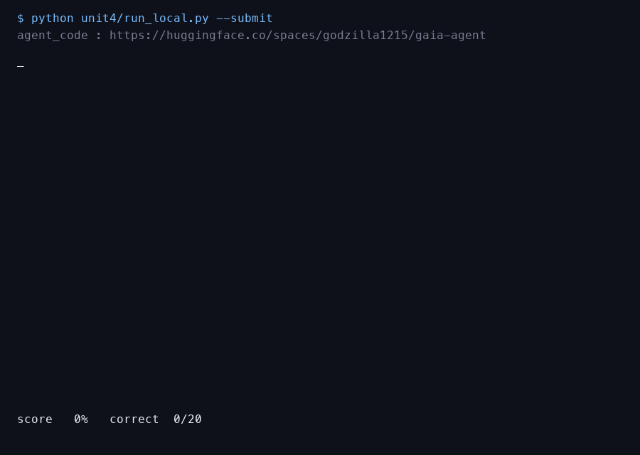
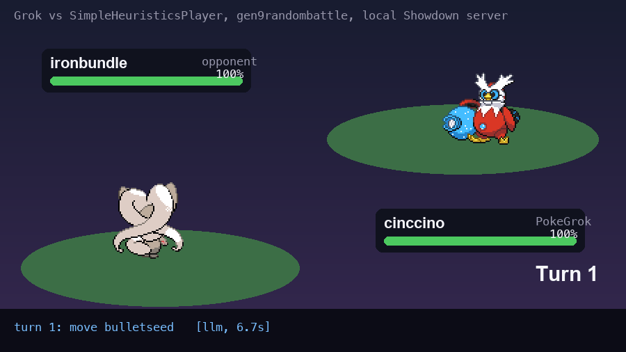

# Hugging Face AI Agents Course

My work through the [Hugging Face AI Agents Course](https://huggingface.co/learn/agents-course):
the smolagents unit, the GAIA final project (scored 100%), and the bonus Pokemon battle agent.

| Unit | What | Result |
| --- | --- | --- |
| [Unit 2.1](#unit-21-smolagents) | smolagents playground: first CodeAgent, tools, sandbox, multi-agent | 8 runnable scripts |
| [Unit 4](#unit-4-gaia-final-project) | GAIA benchmark agent, the final assignment | **20/20 correct, 100%**, on the [student leaderboard](https://huggingface.co/spaces/agents-course/Students_leaderboard) |
| [Bonus 3](#bonus-unit-3-pokemon-battle-agent) | LLM Pokemon battle agent on Pokemon Showdown via poke-env | beats the random bot; see below for the heuristic-bot score |

Certificate of Completion: issued by Hugging Face after the final assignment; claim page at
https://huggingface.co/spaces/agents-course/Unit4-Final-Certificate, score visible on the
[student leaderboard](https://huggingface.co/spaces/agents-course/Students_leaderboard) under `godzilla1215`.

## Unit 4: GAIA final project

The course's final assignment is 20 Level 1 questions from the GAIA benchmark (web research,
attached spreadsheets, audio, images, YouTube, a chess puzzle), scored by exact string match.
30% earns the certificate. This agent scored **100%**.

Public code Space (the URL registered with the scorer): https://huggingface.co/spaces/godzilla1215/gaia-agent

### How it works

`unit4/agent.py` builds a smolagents `CodeAgent`: the model writes Python each step, the
sandbox runs it, and tools do everything the sandbox cannot (disk, network, media).

| piece | choice | why |
| --- | --- | --- |
| brain | xAI Grok 4.6 through LiteLLM (`AGENT_MODEL`, any provider prefix works) | strong multi-hop reasoning, fast |
| hearing | Gemini, walked down a list of models as free-tier daily caps run out | Grok's API has no audio input |
| sight | Grok vision for images and video frames | one bill, no extra key |
| web | DuckDuckGo search, page reader with an in-page `find`, Wikipedia as of a date | GAIA questions cite specific page versions |
| files | pandas for xlsx, subprocess for the attached .py | deterministic answers |
| video | yt-dlp captions plus frames sampled with OpenCV, sent to Grok in batches | YouTube questions |
| chess | two vision models read the board into FEN independently, Stockfish 19 picks the move | the LLM never has to play chess |
| format | rule-based scrubber plus a one-call LLM formatter when the reply looks like prose | exact-match scoring |

`unit4/run_local.py` runs questions one at a time, caches every answer in `answers.json`
(never re-runs a question), hand-checks the three deterministically verifiable answers
against `expected.json`, and submits only after an explicit confirmation. `unit4/app.py` is
the Gradio version for a hosted Space.

Attachments come from the course API, falling back to the official gated GAIA dataset on the
Hub when the course file endpoint 404s. Only the attachment files are ever read from it.

### Run it

    cp unit4/.env.example unit4/.env      # fill in XAI_API_KEY and GEMINI_API_KEY
    pip install -r unit4/requirements.txt
    python unit4/run_local.py             # list the 20 questions
    python unit4/run_local.py --only 3,6  # run some, watch the agent write code
    python unit4/run_local.py --table     # cached answers
    python unit4/run_local.py --submit    # asks you to type SUBMIT

Stockfish is needed for the chess question: `apt install stockfish` on Linux (see
`unit4/packages.txt`), or drop a binary at `unit4/bin/stockfish` on macOS.

## Bonus Unit 3: Pokemon battle agent

`bonus3/` is an LLM that plays gen9randombattle on Pokemon Showdown through
[poke-env](https://github.com/hsahovic/poke-env). It keeps the course's `LLMAgentBase`
contract (one tool call per turn: `choose_move` or `choose_switch`), ported to poke-env 0.16.

What makes it better than the course template:

- the type-chart maths is done in Python and written into the prompt (`vs opponent x4`,
  `expected ~200`), so the model judges instead of calculating
- the opponent's revealed moves, both teams' remaining Pokemon, and the last three turns are
  in the state, so it stops switching in circles
- when the model errors or picks an illegal action, a heuristic picks the strongest move
  instead of a random one
- every turn is logged with the matchup, the action, the reason, and the thinking time

Results on a private local server (grok-4.3, about $0.15 per battle):

| opponent | score |
| --- | --- |
| RandomPlayer | 1-0 |
| SimpleHeuristicsPlayer | 5-battle series in progress |

### Run it

    bash bonus3/server.sh                                        # private Showdown server on localhost:8000
    python bonus3/battle_local.py --agent grok --vs heuristic --n 5
    python bonus3/battle_local.py --play                         # then open http://localhost:8000 and challenge PokeGrok

## Unit 2.1: smolagents

Numbered scripts in this folder, each demonstrating one idea. Each file's comments explain it.

| file | needs a key | what it shows |
| --- | --- | --- |
| `00_check_setup.py` | no | verifies the install and the HF token, prints the fix if broken |
| `01_first_agent.py` | yes | a CodeAgent with `tools=[]`, 2 steps, correct arithmetic |
| `02_agent_with_search.py` | yes | adds a search tool; the output is partly hallucinated, on purpose |
| `03_sandbox_no_token.py` | no | what the sandbox blocks and what it allows |
| `04_proof_llm_cannot_multiply.py` | yes | the raw LLM gets 3 of 4 multiplications wrong |
| `05_why_tokens_grow.py` | yes | the LLM is stateless, so history is re-sent every step |
| `06_multi_agent.py` | yes | a manager agent delegating to a search agent |
| `07_quiz_q1.py` | yes | the unit quiz |

Two errors in the course material, found while doing it:

1. The tutorial defines `suggest_menu` and `catering_service_tool` as plain functions and
   passes them to `CodeAgent(tools=[...])`. Both are missing the `@tool` decorator and fail.
2. The tutorial passes `additional_authorized_imports=['datetime']` and implies it is required.
   As of smolagents 1.26, `datetime` is already on the default allow-list, along with
   collections, itertools, math, queue, random, re, stat, statistics, time and unicodedata.

## Setup

One virtualenv for the whole repo:

    python3.12 -m venv .venv
    ./.venv/bin/pip install -r unit4/requirements.txt -r bonus3/requirements.txt

Keys live in `unit4/.env` (gitignored, see `unit4/.env.example`); `bonus3` reads the same file.
